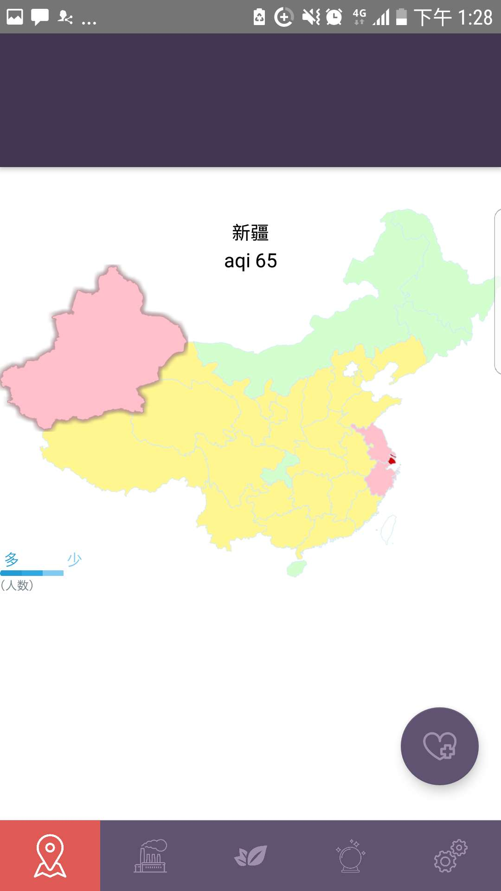
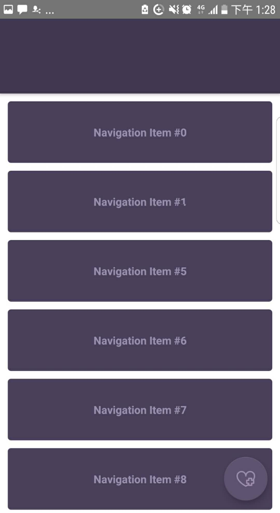

# angelhunt
# VisualHealth
通过svg文件绘制中国地图
An android app use to urge the government to reduce pollution
## Techonology
* RxJava
* Convert svg to canvas path structure
* Canvas draw map
* NavigationTabBar

## Screenshot

<table align="center">
    <tr>
    <td>
      
    </td?
    <td>
      
    </td?
    </tr>
</table>
